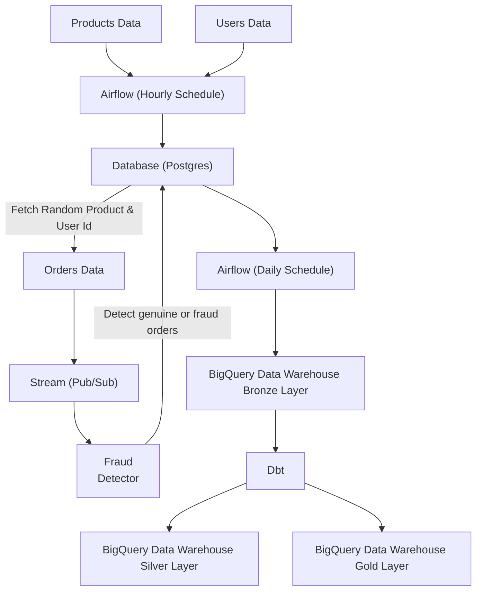

# Ecommerce data stream + ELT batch pipeline project and a fraud detector (Rule Based)

## Overview

This project is to demonstrate a combination of stream pipeline and ELT pipelining using Google Cloud Pub/Sub, BigQuery, dbt, Airflow and Python.

## Technology Used
- **Python** : Main programming language
- **Docker** : Containerized Airflow services and Postgres database
- **Airflow** : Orchestrating Batch pipeline
- **Postgres** : Store source data (Auto Generated Dummy Data)
- **BigQuery** : The Data Warehouse for structured data from batch pipeline
- **dbt** : Modeler for Data Warehouse (uses Medallion Architecture)
- **Pub/Sub** : Run Stream Pipeline main process

## Abstract

This project will demonstrate an ELT pipeline where data is first generated using Python and then stored to local Postgres db, and as for the orders data it will be published to stream using Pub/Sub, then the data then will be ingested by the subsciber and after that the fraud detection system will detect whether the order data is genuine or frauds. It then transferred to BigQuery via the BigQuery hook from Airflow. The data is subsequently transformed into a data warehouse structure via Dbt. The entire pipeline is orchestrated with Airflow.
The end result is transformed data stored in a data warehouse built on BigQuery and dbt, following a medallion architecture with three layers:
- Bronze/Staging layer
- Silver/Refined (Star Schema) layer
- Gold/Data Mart layer

## Pipeline flow

